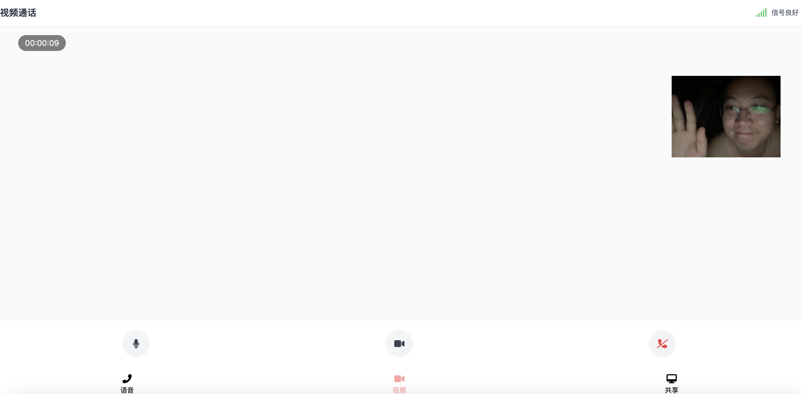
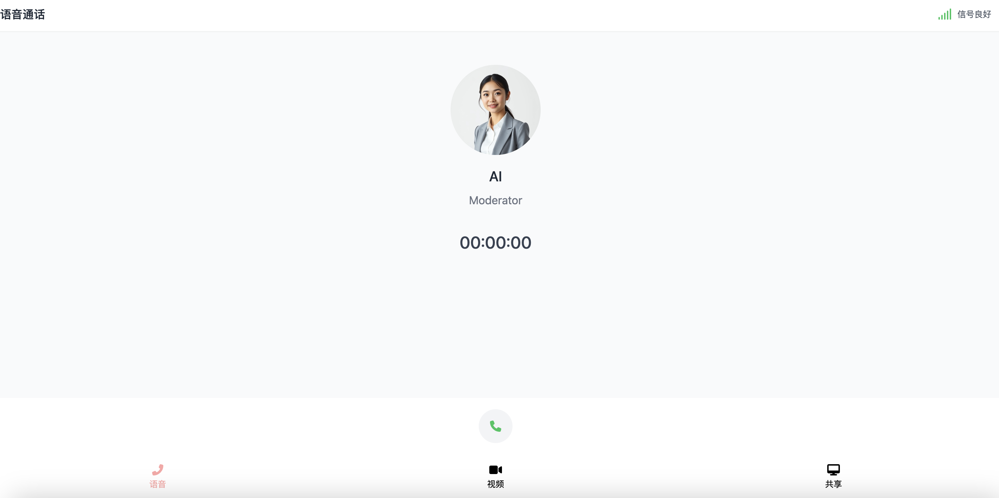

# Gemini 2.0 Call Video Communication App
A real-time video communication app based on React and Gemini 2.0, supporting features such as voice calls, video calls, and screen sharing.


中文README[README_zh.md](README_zh.md)

[Watch Video](https://www.bilibili.com/video/BV1owCcYkEgx/)


## Features

- 💬 Voice Calls
- 📹 Video Calls
- 🖥️ Screen Sharing
- 🎙️ Real-Time Volume Display
- 📊 Call Data Statistics
- 🔄 Real-Time State Synchronization
- 🎛️ Device Control (Microphone/Camera)
- toggle front or backend Camera

## Requirements

- Node.js >= 14
- npm >= 6
- Camera and microphone devices

## Installation Steps

Clone the project
```
git clone <repository-url>
cd geminicall
```

Install dependencies

```
npm install
```

Configure environment variables

```
cp env_template .env
```

Start the development server

```
npm start
```

Build the production version

```
npm run build
```

Run the production version

```
npm run start
```

## 访问
http://localhost:8084/geminicall

## Example Screenshots

### Share Screen


### Video Call



### Voice Call



### Notice
Gemini2.0 quota limit error when try to connect many times in 1 minitue.
Connection closed: received 1011 (unexpected error) Request trace id: c60a47f81f97bfe2, Quota exceeded for quota metric 'Bidi generate content active sessions' and limit 'Bidi; then sent 1011 (unexpected error) Request trace id: c60a47f81f97bfe2, Quota exceeded for quota metric 'Bidi generate content active sessions' and limit 'Bidi
