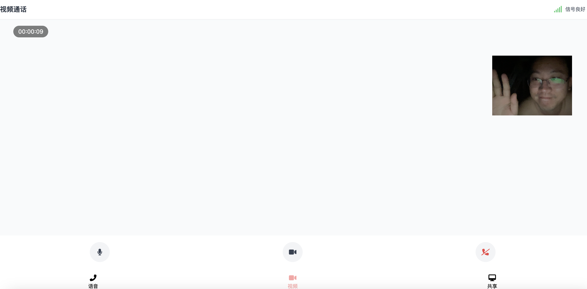

# Gemini2.0 Call 视频通话应用

一个基于React和Gemini2.0的实时视频通话应用,支持语音通话、视频通话和屏幕共享等功能。

[Watch Video](https://www.bilibili.com/video/BV1owCcYkEgx/)

## 功能特点

- 💬 语音通话
- 📹 视频通话
- 🖥️ 屏幕共享
- 🎙️ 实时音量显示
- 📊 通话数据统计
- 🔄 实时状态同步
- 🎛️ 设备控制(麦克风/摄像头)
- 国内可以使用backend_api.py代理gemini2.0的后端
- 前后摄像头切换

## 环境要求

- Node.js >= 14
- npm >= 6
- 摄像头和麦克风设备

## 安装步骤

1. 克隆项目

```
git clone <repository-url>
cd geminicall
```

2. 安装依赖

```
npm install
```

3. 配置环境变量

```
cp env_template .env
```

4. 启动开发服务器

```
npm start
```

5. 构建生产版本

```
npm run build
```

6. 运行生产版本

```
npm run start
```

## 示例界面

共享屏幕


视频通话



语音通话


